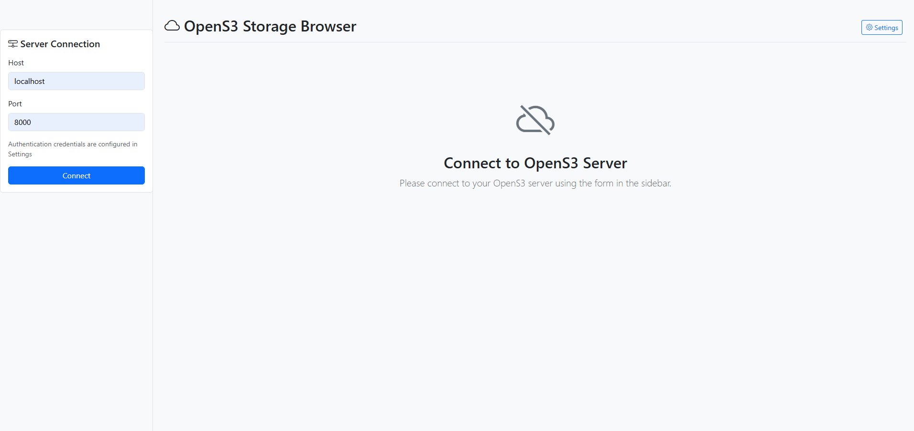

# OpenS3 GUI

A beautiful, interactive GUI for OpenS3 storage service, similar to the AWS S3 console interface.



## Overview

OpenS3 GUI provides a modern web-based interface for managing your [OpenS3](https://github.com/SourceBox-LLC/OpenS3-server) storage. It allows you to easily create and manage buckets, upload and download files, manage directory-like hierarchies, and view object metadata - all through an intuitive browser interface.

## Features

- **Modern, Responsive UI**: Clean, Bootstrap-based interface that works on desktops, tablets, and mobile devices
- **Complete S3 Management**:
  - Connect to any OpenS3 server instance
  - Create, view, and delete buckets
  - Upload, download, and delete objects
  - Navigate folder-like structures within buckets
  - View and manage object metadata
- **Authentication**: Securely connect to your OpenS3 server with proper credentials
- **Configurable Settings**: Save your preferred connection settings
- **Notification System**: Real-time feedback for all operations
- **Improved Error Handling**: Clear, descriptive error messages that guide users through resolution steps

## Installation

### Prerequisites

- Python 3.8+
- pip
- An OpenS3 server instance ([OpenS3-server](https://github.com/SourceBox-LLC/OpenS3-server))

### Setup

1. Clone the repository:
   ```
   git clone https://github.com/SourceBox-LLC/OpenS3-GUI.git
   cd OpenS3-GUI
   ```

2. Create and activate a virtual environment (recommended):
   ```
   python -m venv venv
   ```
   
   On Windows:
   ```
   venv\Scripts\activate
   ```
   
   On macOS/Linux:
   ```
   source venv/bin/activate
   ```

3. Install dependencies:
   ```
   pip install -r requirements.txt
   ```

## Usage

1. Start the application:
   ```
   python app.py
   ```

2. Open your browser and navigate to:
   ```
   http://localhost:5000
   ```

3. Connect to your OpenS3 server:
   - Click the "Settings" gear icon to configure your OpenS3 credentials (default: admin/password)
   - Enter your OpenS3 server host and port in the connection form
   - Click "Connect"

4. Once connected, you can:
   - Create new buckets
   - Upload files to buckets
   - Navigate directories
   - Download files
   - Delete files and buckets
   - View object metadata

## Technical Details

### Architecture

- **Backend**: Flask web server
- **Frontend**: HTML, CSS, JavaScript with Bootstrap 5
- **Storage Integration**: OpenS3-SDK (version 0.1.6 or later)

### Project Structure

```
OpenS3-GUI/
├── app.py                  # Flask application
├── requirements.txt        # Dependencies
├── templates/
│   └── index.html          # Main HTML template
├── static/
│   ├── css/
│   │   └── style.css       # Custom CSS
│   └── js/
│       └── app.js          # Frontend logic
└── venv/                   # Virtual environment (not in repo)
```

## Development

### Adding Features

1. Fork the repository
2. Create your feature branch: `git checkout -b feature/amazing-feature`
3. Commit your changes: `git commit -m 'Add some amazing feature'`
4. Push to the branch: `git push origin feature/amazing-feature`
5. Open a Pull Request

## License

This project is licensed under the MIT License - see the LICENSE file for details.

## Related Projects

- [OpenS3-SDK](https://github.com/SourceBox-LLC/OpenS3-SDK) - Python SDK for OpenS3
- [OpenS3-server](https://github.com/SourceBox-LLC/OpenS3-server) - S3-compatible object storage server

## Troubleshooting

### Common Error Messages

#### Bucket Operations

- **Cannot Delete Non-Empty Bucket**: When attempting to delete a bucket that contains objects, the system will display a warning message explaining that all objects must be deleted first. This helps prevent accidental data loss.

#### Object Operations

- **Bucket Not Found**: Ensure the bucket exists before attempting to view or modify its contents.
- **Object Not Found**: The requested object may have been deleted or the path is incorrect.

### Tips

- Always check notification messages that appear at the top of the screen for important feedback.
- For bucket deletion, first delete all objects within the bucket before attempting to delete the bucket itself.
- If you encounter unexpected errors, check the OpenS3 server console for more detailed error information.

## Acknowledgements

- [SourceBox LLC](https://github.com/SourceBox-LLC) for creating the OpenS3 ecosystem
- [Bootstrap](https://getbootstrap.com/) for the frontend framework
- [Flask](https://flask.palletsprojects.com/) for the web framework
